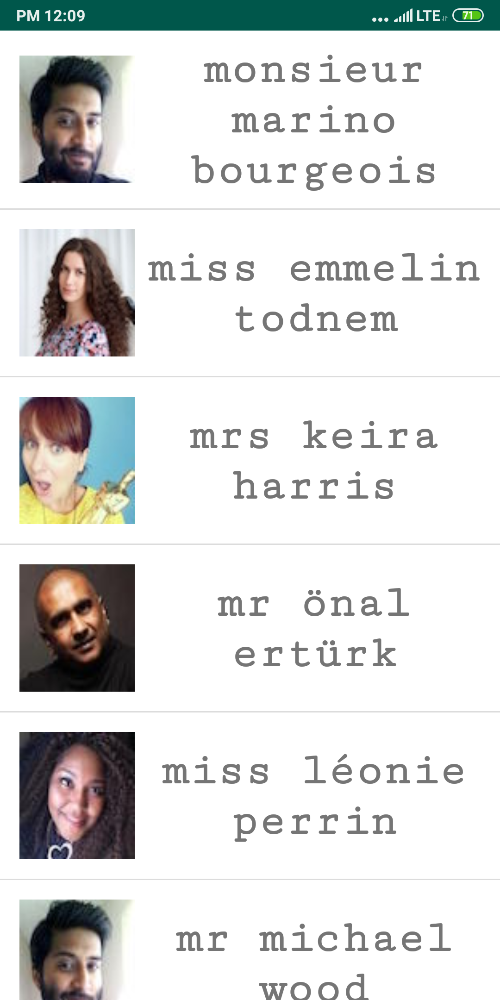
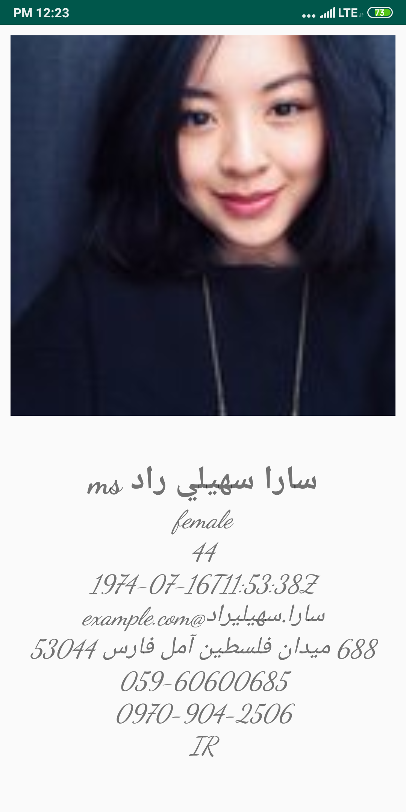
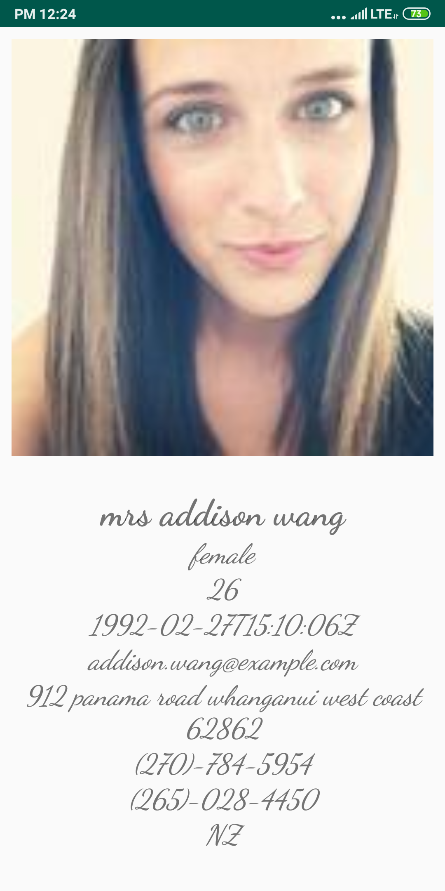

# Week3Daily3HomeAssignment
Use the HttpURLConnection to make a REST call and get 15 results from the random user api. Display the results in a recycler view.  The item should show the users name and a small image of the user. When clicking on an item,  display a activity with a fragment that will show a larger image, and more details about the user (pick at least 10 from the api response)

The list of users.

User Details are : 

